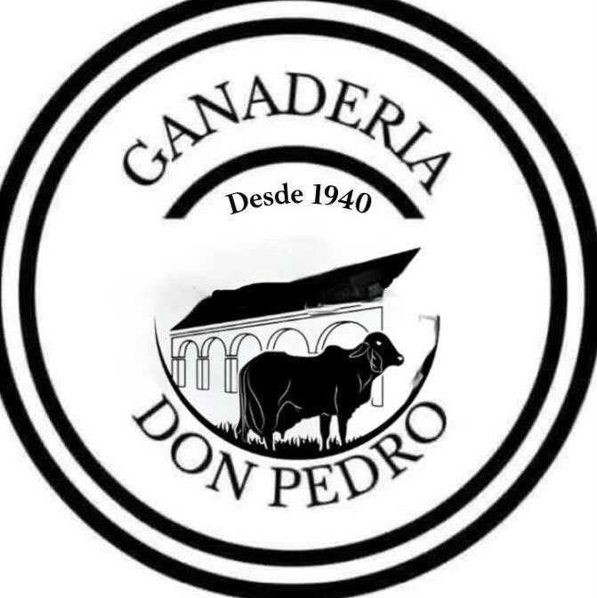

<div align="center">

  

  <h1>Ganadería Don Pedro</h1>

  <p><strong>Tradición ganadera, presencia digital.</strong></p>

  <p>Sitio web con catálogo interactivo y contacto por correo para una ganadería de Tlacotalpan, Veracruz, con historia desde 1940.</p>

  <p>
    
    
    
    
  </p>

  <p><a href="#el-proyecto">Proyecto</a> · <a href="#funcionalidades">Funcionalidades</a> · <a href="#ejecutar-en-local">Instalación</a> · <a href="#autor">Autor</a></p>

</div>

---

## El proyecto

Ganadería Don Pedro reúne identidad, historia y oferta ganadera en una experiencia web organizada por páginas. El visitante puede conocer las razas, explorar ejemplares y contactar a la ganadería desde cualquier sección.

El diseño combina una paleta sobria, tipografía editorial e imágenes del campo. La navegación separa la presentación institucional del catálogo, mientras que el footer concentra el formulario, los datos de contacto y las preguntas frecuentes.

La implementación utiliza **Next.js App Router, React y TypeScript**, con componentes compartidos y rutas de servidor para el catálogo y las consultas por correo.

## Funcionalidades

| Área | Experiencia |
| --- | --- |
| **Inicio** | Presentación de la ganadería y acceso a sus páginas principales. |
| **Historia** | Espacio dedicado al origen y la tradición de Ganadería Don Pedro. |
| **Genética** | Presentación de las razas Gyr y Sardo Negro, con enlaces al catálogo filtrado. |
| **Ejemplares** | Catálogo con filtros y consulta de detalles en una ventana modal. |
| **Contacto** | Formulario con asuntos predefinidos, raza de interés y validación de datos. |
| **Correo** | Botón para copiar la dirección y envío desde el servidor mediante SMTP. |
| **WhatsApp** | Acceso al chat con icono y número visible en el footer. |
| **Preguntas frecuentes** | Respuestas desplegables sobre ejemplares, pedigree y cobertura. |
| **Diseño adaptable** | Distribución para escritorio y celular, con menú móvil. |

## Decisiones de implementación

- **Páginas independientes:** cada área tiene su propia ruta y la navegación identifica la página activa.
- **Componentes compartidos:** el encabezado y el footer mantienen la misma experiencia en todo el sitio.
- **Catálogo desde el servidor:** los datos iniciales se entregan a React sin una petición adicional del navegador. La API permite consultar esos mismos registros en JSON.
- **Contacto validado en ambos lados:** los asuntos permitidos se comparten entre el formulario y el servidor; “Otra consulta” requiere un mensaje.
- **Confirmación de envío:** el formulario confirma cuando el servidor SMTP acepta la consulta. Si ocurre un error, conserva los datos para reintentar.
- **Credenciales en el servidor:** la conexión SMTP se configura mediante variables de entorno.

## Tecnologías

| Tecnología | Uso |
| --- | --- |
| Next.js · App Router | Páginas, renderizado y rutas de servidor. |
| React | Filtros, modal, menú móvil y formulario. |
| TypeScript | Tipos del catálogo y validación de consultas. |
| CSS | Identidad visual, estados interactivos y adaptación por tamaño de pantalla. |
| Nodemailer | Envío de consultas mediante SMTP. |

## Ejecutar en local

Requiere **Node.js 20.9 o superior**. Desde la carpeta que contiene `package.json`:

```bash
npm install
npm run dev
```

Abre [http://localhost:3000](http://localhost:3000).

| Comando | Función |
| --- | --- |
| `npm run dev` | Inicia el entorno de desarrollo. |
| `npm run typecheck` | Comprueba los tipos de TypeScript. |
| `npm run build` | Genera la versión de producción. |
| `npm start` | Ejecuta la versión generada por `build`. |

### Configurar el correo

El sitio puede ejecutarse sin credenciales SMTP; para habilitar el envío, copia `.env.example` como `.env.local` y completa:

```dotenv
SMTP_HOST=
SMTP_PORT=587
SMTP_USER=
SMTP_PASSWORD=
CONTACT_FROM_EMAIL=
CONTACT_TO_EMAIL=udvtz@hotmail.com
```

`CONTACT_FROM_EMAIL` debe ser un remitente autorizado por el proveedor. `CONTACT_TO_EMAIL` recibe las consultas; el correo del visitante se establece como **Reply-To** para responderle directamente.

El puerto `465` utiliza TLS directo; los demás requieren STARTTLS. Reinicia el servidor después de modificar las variables. En producción, configúralas en el servicio de hosting. `.env.local` está excluido de Git.

## Organización del código

| Ubicación | Contenido |
| --- | --- |
| `src/app/` | Inicio, historia, genética, ejemplares y estructura global. |
| `src/app/api/ejemplares/route.ts` | API de lectura del catálogo. |
| `src/app/api/contacto/route.ts` | Validación de consultas y envío SMTP. |
| `src/components/` | Encabezado, footer, catálogo y controles de contacto. |
| `src/lib/catalog.ts` | Tipos y datos de los ejemplares. |
| `src/lib/contact.ts` | Asuntos permitidos y validación del formulario. |
| `src/app/globals.css` | Estilos globales y diseño adaptable. |
| `public/assets/` | Logo e imágenes del sitio. |

## Estado del proyecto

**En desarrollo.** La navegación, el catálogo interactivo y el formulario están implementados. La compilación de producción, la validación del endpoint y el envío SMTP se comprobaron con un servidor de prueba local. La entrega a un buzón real queda pendiente de configurar y probar con el proveedor de correo.

Las fotografías del catálogo son generadas e ilustrativas y los registros son de ejemplo. La información comercial y las fotografías reales deben validarse con la ganadería antes de publicar la oferta definitiva.

El catálogo se administra actualmente desde el código. Todavía no incluye base de datos, autenticación, panel administrativo ni conexión con Google Sheets o Drive.

### Próximas etapas

- Incorporar fotografías y fichas reales de ejemplares.
- Configurar y verificar el correo en el entorno de producción.
- Añadir protección contra spam al formulario antes de abrirlo al público.
- Definir la fuente de datos y el flujo de actualización del catálogo.
- Evaluar un panel de administración según las necesidades de la ganadería.

## Autor

**Eduardo Rodríguez Solís** · Desarrollo web

[Portafolio](https://portafolio-ers.vercel.app/) · [GitHub](https://github.com/eduard165)

La identidad y el logotipo de Ganadería Don Pedro pertenecen a sus respectivos titulares.
